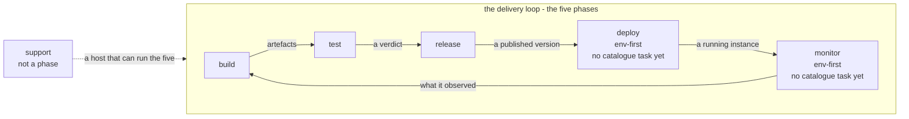

Every Simplon product hangs its commands off the same six top-level groups, and it cannot invent a
seventh. Five of them are the **phases of the delivery loop** - `build`, `test`, `release`, `deploy`,
`monitor` - and `support` is the group that supports those five rather than a sixth of them.

That is the corset the rest of this half of the site is written inside. The manifest chapter describes a
file whose top level is these groups; the environments chapter is about a distinction that exists only
between them; the placement rule in [Task and command](../../how/task-and-command/) is a rule about their
names. This chapter is the one that says what they are.

## The five, and the one beside them

The wording below is the catalogue's own - `src/simplon/catalogue.yaml` declares each group with the
`help:` a product inherits, so this table is a reading of the file every product merges onto:

| group | what it means | takes an environment |
|---|---|---|
| `build` | Produce the artefacts. | no |
| `test` | Verify them. | no |
| `release` | Publish them. | no |
| `deploy` | Put them into an environment. | **yes** |
| `monitor` | Watch what is running there. | **yes** |
| `support` | Host preflight, environment introspection and host tooling. | no |

Five verbs and a workbench. The five are what a component *does* on its way from a source tree to
something running that somebody is watching; `support` is what you need in order to be able to do them
at all - a machine with the right tooling on it, a list of the environments that exist, the git verbs.
It sits beside the loop, not inside it, and nothing in the loop's flow passes through it.


**Why this distinction is worth being pedantic about.** `support` carries a placement exactly like the
five: `support:install` belongs under `support` and nowhere else, and the loader says so. So the
*placement rule* is stated over all six **groups**. It does not follow that there are six phases - the
sixth group is a workbench, and a page or a message that counted six would be telling a reader the loop
has a stage it does not have. Six groups, five phases.


## What flows between them

The five are a loop rather than a list, and what makes it one is that each hands the next something
concrete. Read the labels, not the boxes - the boxes are only names:



Each arrow is a handover, and each one is a different kind of thing:

- **`build` hands `test` artefacts.** Files that exist: a wheel, an image, a bundle. Not a promise that
  they work - that is the next arrow's job.
- **`test` hands `release` a verdict.** A pass or a fail over artefacts that already exist. This is why
  `test` never builds: a suite that rebuilds what it verifies has verified something nobody shipped.
- **`release` hands `deploy` a published version.** The artefacts, plus an identity somebody else can
  ask for by name - a tag, a version, a digest in a registry. Publishing is where a mistake stops being
  local.
- **`deploy` hands `monitor` a running instance.** Not a file any more: a thing with a state, in one
  named environment.
- **`monitor` hands `build` what it observed.** The loop closes here, and that is the only reason it is
  a loop. Monitoring that reaches nobody is a fifth phase that does not connect to a first.

`support` touches all five and is on none of the arrows, which is the picture of what it is: nothing is
handed *along* it. It is the bench the other five stand on.

## Why there are five, and not a sixth

Because a product cannot declare a group the platform does not already declare - and the refusal is not
a rule layered over the merge, it **is** the merge. A product's tree is merged onto the platform's, so a
path the platform does not declare has nowhere to land. That mechanism, and the load error it produces,
are set out in [What Simplon is](../../why/why/#the-cicd-process-is-a-closed-vocabulary) and are not
repeated here.

What follows from it is the thing this chapter is about: `test` means *verify* in every product built on
the kernel, and `myctl prod deploy up` reads the same to somebody who has never seen that product. The
vocabulary is worth exactly as much as it is fixed, which is why the five are declared once, centrally,
and why a sixth would have to be declared there too - once, for everybody.

## Env-first, and agnostic

`deploy` and `monitor` are declared `env_first: true` in the catalogue; the other three are not. That
one flag is the whole of the difference, and it runs in both directions:

```text
myctl prod deploy up        # the environment comes first, before the group
myctl deploy up             # refused: this group needs an environment
myctl build wheel           # no environment, and none accepted
myctl dev build wheel       # refused outright: this group takes no environment
```

The two env-first phases are the two that act **on** something rather than producing something. A
deployment is always a deployment *somewhere*, and "what is running" is only a question about one
environment at a time - so naming the environment is part of naming the command, which is why it is the
outer token rather than an option.

The other three refuse an environment token, and the reason is worth stating as a claim about
artefacts rather than as a convention: a wheel built "for dev" is either byte-identical to the one you
would have built anyway, in which case the token meant nothing, or it is a different artefact, in which
case the thing you tested and the thing you ship have quietly become two things.

The declaration, the matrix of environments, the dispatch's four steps and the backend gate are in
[Environments](../environments/).

## What the catalogue offers today

A coordinate reaches a phase two ways, and [Task and
command](../../how/task-and-command/#placement-or-family-which-half-of-a-coordinate-says-where-it-goes) is
where that rule lives:

- a coordinate whose namespace **is** a group name carries a **placement** - `build:image` sits under
  `build`, in every product, always;
- any other namespace is a **family**, and the product files it where it likes - `docs:site` is under
  `build` in simplon and could be under `release` somewhere else.

So the count of tasks *named after* a phase is not the count of commands that phase ends up holding. It
is, however, the honest measure of what the platform carries **for that phase and no other**, which is
the number that says whether a rib is filled:

| namespace | kind | tasks in the catalogue today |
|---|---|---|
| `build` | phase, agnostic | 6 |
| `test` | phase, agnostic | 5 |
| `release` | phase, agnostic | 6 |
| `deploy` | phase, env-first | 0 |
| `monitor` | phase, env-first | 0 |
| `support` | not a phase | 8 |
| `vcs` | family | 5 |
| `docs` | family | 3 |
| `tasks` | family | 2 |
| `toolchain` | family | 1 |

Thirty-six coordinates: twenty-five carrying a placement, eleven free to be filed. The numbers in this sentence, in that
table and in every section below are read back out of `catalogue.yaml` by the test suite and compared with what is
printed here, because a count typed into a page is wrong on the day the next task lands and nobody finds
out.

**What each coordinate does is not written out here.** The sections below name them and nothing more,
and the sentence that says what one is for lives in the [command
reference](../commands/) - generated on every build from the catalogue's own `help:`, for
every coordinate there is. This page used to paraphrase those sentences beside the names, and by the time anybody
compared them several had quietly stopped saying what the catalogue says: `docs:render` had grown the
word *architecture*, `test:typecheck-python` had lost *(no Docker, no lab)*, `vcs:submodules` had lost
`lib/platform`. How many is a matter of how strictly one reads, and no count stands here for exactly
that reason - a number typed onto a page is the second source this paragraph is about. The reliable
fix is not to guard the copy but not to keep one.

Separately from all of this, a catalogue task is either **offered** - a product declares a command for
it - or **placed**, written into the tree for everybody. The bar a placed command has to clear, and why
`release:tag` does not clear it, are in [Offered, or placed](../../how/task-and-command/#offered-or-placed).

### `build`

*Produce the artefacts.* Whatever a product ships: a wheel, a container image, a bundle, a generated
site.

**In the catalogue today: 6 tasks.**

- `build:cmake-files`
- `build:conan-cache`
- `build:dotnet-solution`
- `build:image`
- `build:nuget-config`
- `build:nuget-restore`

**What a product brings itself.** The artefact, and the source tree the two generators read. There are
three things the kernel knows how to build for you: a container image, the build files a C++ or a .NET
product hands to its compiler, and - since si#127 and si#128 - the half of a package handover that
happens on the CONSUMING side. Everything past that is a body in the product's own `tasks:`, because
"build" means something different in every language. Each of the six reads something the product
brings - `build:image` an `images:` section, the two generators a tree of sources, the other three an
`artifacts:` entry - which is why all
six are offered rather than placed: declared for everybody, `build:image` would die on its first
line in a product with no Dockerfile, and a generator would write a CMake project for a product with
no C++ in it.

**The tree is the declaration, and the manifest is the exception.** A directory holding sources
already says what it is - a library, or an executable when it holds a `main` - so the generators read
that rather than asking a product to state it twice. The one thing a directory cannot show is what a
target depends on, and that is the whole of what the optional `build: targets:` block carries.
Guessing it from include paths was considered and refused: it reads a C++ preprocessor approximately,
and an approximate answer in a build file fails at link time, in a message about symbols rather than
about the manifest.

**What they write is COMMITTED**, which is what makes determinism load-bearing rather than tidy.
Everything is sorted, and a solution's GUIDs are derived with `uuid5` from the project's path rather
than generated - a random one would put a new GUID in the diff on every run and make the committed
output unreviewable within a week. Each generated file carries a `DO NOT EDIT` header, and the
generator overwrites without asking. That is deliberately the opposite of `support:toolchain`'s
never-clobber rule, and the difference is the subject: a manifest is a product's own statement, a
`CMakeLists.txt` is a rendering of one. Reverting a statement would be wrong; reverting a rendering is
the point. A product whose build outgrows what the two generators can express keeps its hand-written
files and declares neither coordinate - nothing degrades, it simply does what every product does today.

This is also the rib where families land most, and simplon's own `build` is the illustration: it holds
four commands - `wheel`, `reference`, `site` and the `docs` aggregate - and not one of them is
`build:image`. The count of phase-named tasks is not the count of commands a phase ends up with.

### `test`

*Verify them.* Over artefacts that already exist - the phase deliberately does not produce any.

**In the catalogue today: 5 tasks.**

- `test:gate`
- `test:accept`
- `test:report`
- `test:release-notes`
- `test:typecheck-python`

**What a product brings itself.** A `suites:` section naming its levels, and a `mypy.ini` if it wants
the type gate. `test:gate` is the clearest case in the catalogue of one body under several names: a
product declares one command per level and pins the level with `with:`, so `test unit` and `test system`
are two commands over one template. That mechanism is in [Test levels](../test-levels/).

**Four of the five run something; the fifth reads the repository.** `test:release-notes` declares no
gate and calls no runner. It asks one question - does the releases page describe the releases this
repository actually carries - and answers it out of `git tag`, `git log` and the page's own headings.
It is in `test` because its verdict is red or green and nothing else, and it is not in `release`
because release notes are written *before* the tag: a guard that only spoke when `release tag` was
typed would speak after every cheap chance to fix it had passed. What is the product's own reaches it
through a `releases:` section, in [The manifest](../../how/manifest/#releases---where-the-notes-live-and-from-when-they-are-complete).

### `release`

*Publish them.* The point where a mistake stops being local: a tag can be deleted but not un-seen, and a
pushed image is somebody else's dependency by the time you notice.

**In the catalogue today: 6 tasks.**

- `release:artifact`
- `release:asset`
- `release:conan`
- `release:image`
- `release:nuget`
- `release:tag`

**What a product brings itself.** An `artifacts:`, `assets:` or `images:` section, and - for
`release:tag` - a workflow that a tag actually triggers. All six are **offered** rather than placed, and `release:tag`
is the case that fixed that bar: it is the one `release:` task that reads no product data at all, so it
came closest to being handed to everybody, and it is still not - because it **publishes**, and a
misfire is public and cannot be taken back.

`release:artifact` and `release:asset` are the same act aimed at different readers: a directory in a
registry that a consuming pipeline pulls with its own token, and files on a release page that a person
downloads. Which of the two a product offers is a question about its audience, and about what its
licence lets it hand out - never one the kernel answers for it.

`release:image` is worth reading as a rule rather than a task. It pushes *and then asks the registry
whether the tag is there*, because a push nobody verifies is the same defect as a report nobody reads.

`release:nuget` and `release:conan` are two different answers to one question, and the difference is not
this kernel's taste - it is what GitHub Packages serves. NuGet is a registry it has, so `release:nuget`
packs a project and pushes it to `nuget.pkg.github.com`, and `build:nuget-config` and
`build:nuget-restore` are the consuming half. **There is no Conan registry in GitHub Packages at all**,
so `release:conan` is a *transport*: `conan cache save` writes an archive, this moves that archive into
the registry as an ordinary OCI artifact, and `build:conan-cache` pulls the exact tag back for the
product's own `conan cache restore`. No dependency graph is solved remotely and no version range is
resolved - that distinction is spelled out in [Handing a package over](../../what/handing-a-package-over/).

### `deploy`

*Put them into an environment.* Env-first: the environment is the outer token, before the group.

**In the catalogue today: 0 tasks.**

**What a product brings itself.** All of it - the commands and the bodies both. See [the two empty
ribs](#the-two-empty-ribs) below, because this emptiness is the one worth explaining rather than
listing.

### `monitor`

*Watch what is running there.* Env-first, for the same reason: "what is running" is a question about one
environment.

**In the catalogue today: 0 tasks.**

**What a product brings itself.** All of it, again.

### `support`

*Host preflight, environment introspection and host tooling.* Not a phase - the group the five stand on.

**In the catalogue today: 8 tasks.**

- `support:install`
- `support:nexus`
- `support:claude-plugins`
- `support:environments`
- `support:workflows`
- `support:completion`
- `support:ci-privileges`
- `support:toolchain`

**What a product brings itself.** Nothing, for `support:install` and `support:completion` - they are the
two tasks here the catalogue **places**, so every product gets `support install` and `support completion`
without asking. One touches the machine and reads no manifest at all; the other writes the product's
shell completion out of the command tree every manifest already has, and a completion that has to be
asked for is a completion nobody has. Four of the rest each read a section (`nexus:`, `claude:`,
`environments:`, `workflows:`) and are therefore offered.

`support:toolchain` is offered for a third reason again (si#95): it reads no section, and it could be
placed - but it WRITES the product's own manifest, and a command that edits the file a product is defined
by should be one the product asked for. What it writes is a language's ready-made build, so that a
product declares its parameters and receives the rest.

`support:ci-privileges` is the one that is offered for a different reason (si#92). It reads no section at
all, so by the test above it could be placed - and it deliberately is not, because it grants
`NOPASSWD: ALL` and a docker group. A command that changes who may become root on a machine has to be
something a product asked for, not something it received with the kernel. It is also the only task here
that refuses unless it is run as root, and says so: the privilege it hands out is the one the kernel
needs in order to be allowed to do anything, so it cannot take it from inside a job.

## The two empty ribs

`deploy` and `monitor` have **no catalogue tasks**. Not few: none. A product that deploys writes every
line of its deployment itself, and the kernel contributes the group name, the env-first gate and nothing
else.

That is not a gap the way a missing feature is a gap. It is the *most expensive* two ribs to leave
empty, and the reason is exactly why they are the env-first pair. Every other phase is about the
product's own material - only this product knows what its artefact is or which suites it has. Deploying
and monitoring are about **the environment**, and the environments are shared: three products pointing
at the same Portainer, the same Proxmox, the same Exoscale account are three products writing the same
provider three times. Repetition of that exact shape is what the kernel was extracted to remove.

So these two are where reuse would be worth the most and where there is none - and the honest thing to
do is draw the rib empty. A documentation page that showed a filled `deploy` because a filled `deploy`
is what the picture wants would be worse than no page: the reader would go looking for a command that
does not exist and conclude they had misread the site.

What has to be decided before those ribs can be filled - provider in the kernel behind an extra,
provider as a separate package, or provider in the product - is open as
[simplon#5](https://github.com/marcozwyssig/simplon/issues/5).

## The families, and where they land

The other ten coordinates name no group, so they say what a task **is** without saying when it runs. A
product files each one where it belongs in *its* loop:

### `vcs`

**In the catalogue today: 5 tasks.**

- `vcs:commit`
- `vcs:push`
- `vcs:prune-branches`
- `vcs:submodules`
- `vcs:auth-scopes`

Committing belongs to no phase at all, which is the clearest argument that the second axis has to exist:
had every coordinate been forced to name a group, this family would have been the first thing to break.
The catalogue places all five under `support git`.

### `docs`

**In the catalogue today: 3 tasks.**

- `docs:render`
- `docs:site`
- `docs:reference`

This family is the standing example of why placement is the product's call: simplon files two of
them - `docs:reference` and `docs:site` - under `build`, and a product that publishes its site as part
of shipping would file `docs:site` under `release` and be just as right.

### `tasks`

**In the catalogue today: 2 tasks.**

- `tasks:generate`
- `tasks:catalogue`

The task machinery itself, and host tooling for whoever develops the product rather than a stage of the
loop - which is why the catalogue places both under `support tasks` and not at the top level, where
`tasks` would have claimed a very generic token beside `build` and `test`.

### `toolchain`

**In the catalogue today: 1 task.**

- `toolchain:run`

A pinned image run over the product tree, as the calling user, with named caches (si#95). It is the half
of a build that is the same in every language: Java, C++, .NET and Python differ in which image runs and
which argv it is handed, not in how a container is wired to a source tree.

**A family rather than a placement, and that is load-bearing.** A coordinate opening with a group name may
only be placed under that group, and a toolchain is needed by `build` AND `test` - `ctest`,
`dotnet test` and `gradle test` all belong under the latter. `build:toolchain` would have been unusable
where half its callers live.

**What a product brings itself.** The image, the argv and the caches - or rather, it does not type them:
`support toolchain <language> <version>` writes a ready-made configuration into the manifest, and the
product owns it from then on. Scaffolded rather than resolved at run time, so a kernel release can never
change how a product builds.

**And it writes every one of them under `build`** (si#111), including `unit` and `analyse`, which the
si#95 design's own command table had put at `test unit` and `test analyse`. The split the kernel keeps is
not build-versus-test by subject matter but **rc versus verdict**: a `toolchain:run` command runs a
pinned image over the tree and hands back the container's exit code, and that is all it does, while a
gate under `test` turns one of those commands into a verdict with a setup marker and an archive
([Test levels](../test-levels/#a-gate-may-name-a-command-in-your-own-tree)). Filing the bare `ctest` at
`test unit` would stand a number with no verdict beside a verdict under one group, and the number is
exactly the one that reports last week's binaries as a full green suite. `toolchain:run` remains a
family for the reason above and not for this one: a product may file it anywhere it needs, and the C++
use case files the very same coordinate under `deploy up` to run the binary it compiled.

**Read the exit code against 0, never against 1.** The kernel returns what the container returned and
interprets nothing, and the tools disagree about what failure is worth: a failing `ctest` run exits **8**,
`dotnet format --verify-no-changes` exits **2** on a formatting fault, `gradle test` and `mypy` exit 1.
A CI step or a gate that compares to `1` reads two of those four as a pass.

**What a command declares is what the impl takes.** The `with:` block's keys - `image`, `workdir`,
`argv`, `env`, `caches` - are the body's parameters one for one, because that is how the loader binds a
`with:` block at all (si#105). Pin every one a command uses: an unpinned parameter is rendered as a real
option, so a command that leaves `env:` out grows a real `--env` - and no profile pins `env:` or
`caches:`, so a scaffolded command carries both until the product writes them. A value typed into one of
those is refused by the same gate that reads the manifest, naming the command, rather than crashing
inside the body. What the caller types after the command name is APPENDED to the manifest's argv, and an
empty tail changes the line by not one byte.

## Where to go next

The six groups are the top level of every manifest, so [The manifest](../../how/manifest/) is the next chapter
to read: the tree, the group lock, and the product data sections each of the tasks above reads.

For what this looks like on a real product, the [command reference](../commands/) is simplon's
own, generated from the assembled application on every build - and worth reading for what is *not* in
it. There is no `deploy` and no `monitor` in that reference at all, because a group with no command
anywhere under it does not render, and simplon deploys nothing and watches nothing. The two empty ribs
are visible from the other side there.
